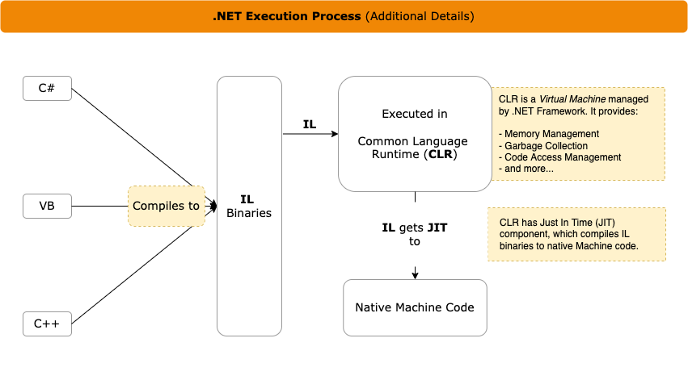

# Objective

You will understand concepts involved in executing your .NET Code (e.g. IL, CLR) and hosting options (InProcess and OutOfProcess).

## .NET Execution Concepts

click to expand

1. Diagram below shows TL;DR version of the process for you writing your code to its execution.

1. Diagram below shows additional details.

## .NET Hosting Models

click to expand

There are two hosting models, InProcess and OutOfProcess. Both are discussed below.

> Side note: Kestrel is a lightweight, cross-platform, and open-source web server for ASP.NET Core. It is included and enabled by default in ASP.NET Core. Kestrel is supported on all platforms and versions supported by .NET Core.

### **InProcess Hosting Model**

1. InProcess hosting runs ASP.NET Core app in the same process as its IIS worker process and Kestrel is not used.

1. InProgress hosting provides improved performance over OutOfProcess hosting. Its because requests aren't proxied over the loopback adapter.

    

Diagram Walk-through (source: MS documentation)

1. Request arrives from the web to the kernel-mode HTTP.sys driver.

1. The driver routes the native request to IIS on the website's configured port; usually 80 (HTTP) or 443 (HTTPS).

1. ASP.NET Core Module receives the native request and passes it to IIS HTTP Server (IISHttpServer). IIS HTTP Server is an in-process server implementation for IIS that converts the request from native to managed.

1. Request is then sent to the ASP.NET Core middleware pipeline and processed.

### **OutOfProcess Hosting Model**

1. Running out of process - separate from IIS worker process - ASP.NET Core Module handles process management: it starts the process for the ASP.NET Core app when the first request arrives and restarts the app if it shuts down or crashes.

1. With OutOfProcess, there are two web servers
    1. Internal web server, Kestrel.
	1. External web server; it can be IIS, NGINX, or Apache.

    

1. Requests arrive from the web to the kernel-mode HTTP.sys driver.

1. Driver routes the requests to IIS on the website's configured port; usually 80 (HTTP) or 443 (HTTPS).

1. ASP.NET Core Module forwards the requests to Kestrel on a random port for the app. The random port isn't 80 or 443.

1. After Kestrel picks up the request from the module, the request is forwarded into the ASP.NET Core middleware pipeline and processed.

